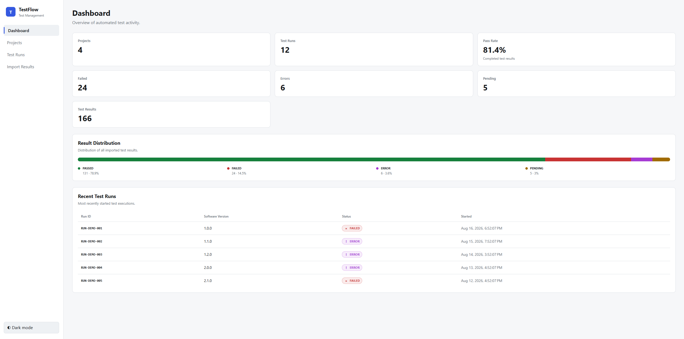
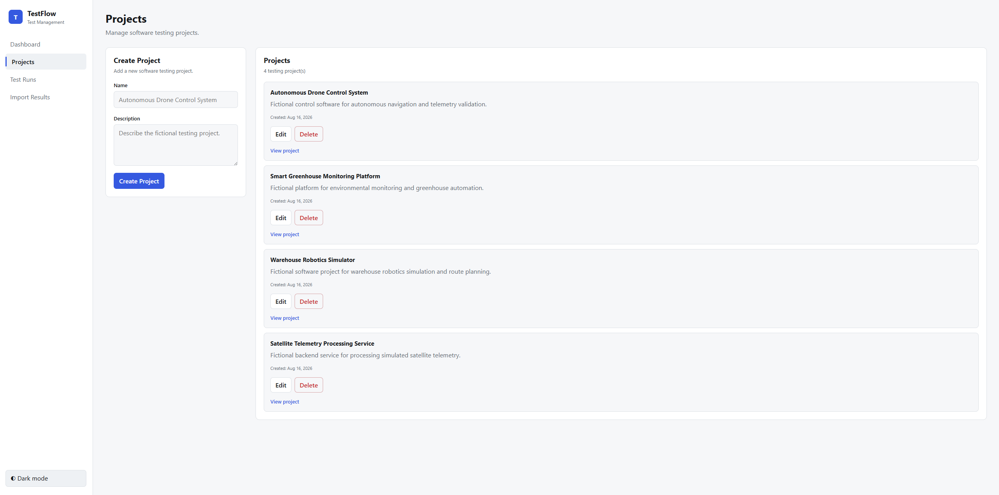
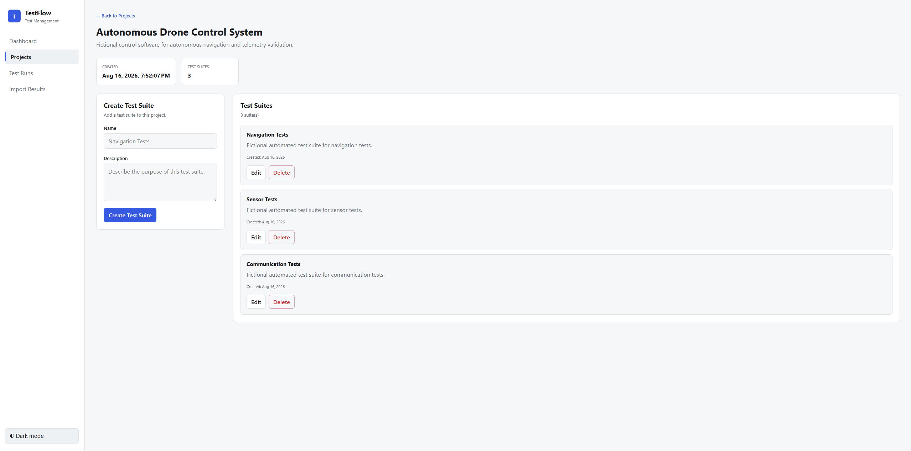
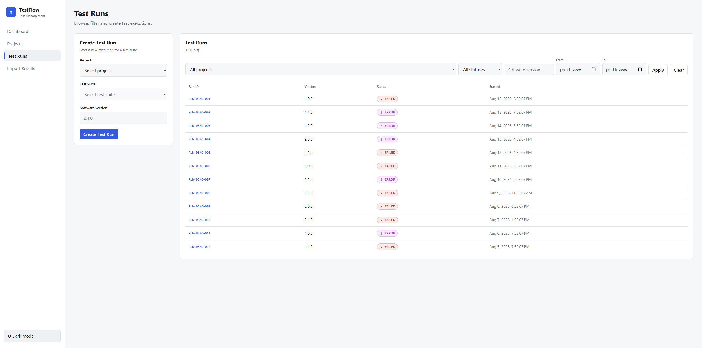
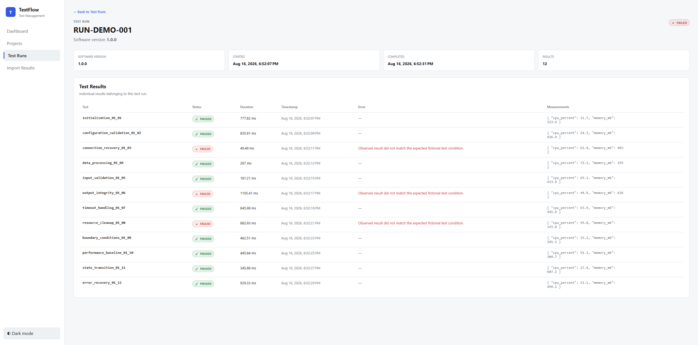
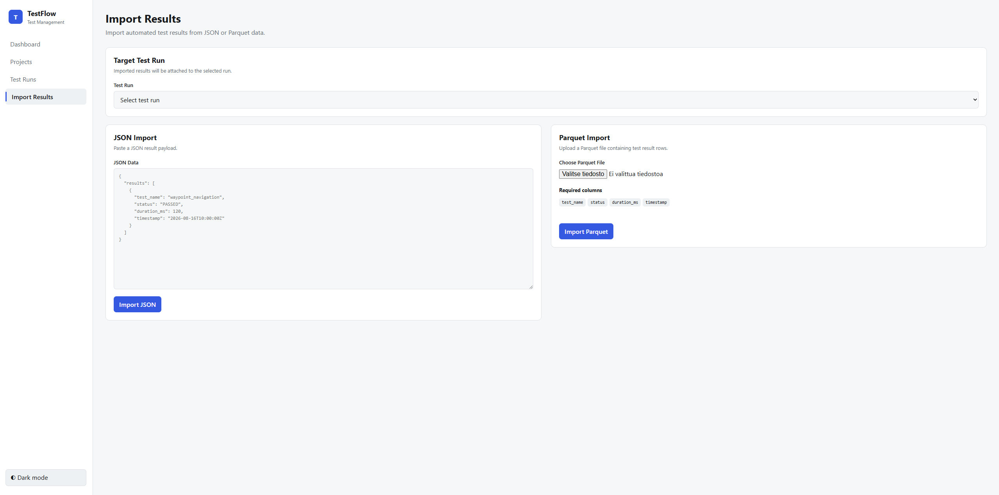
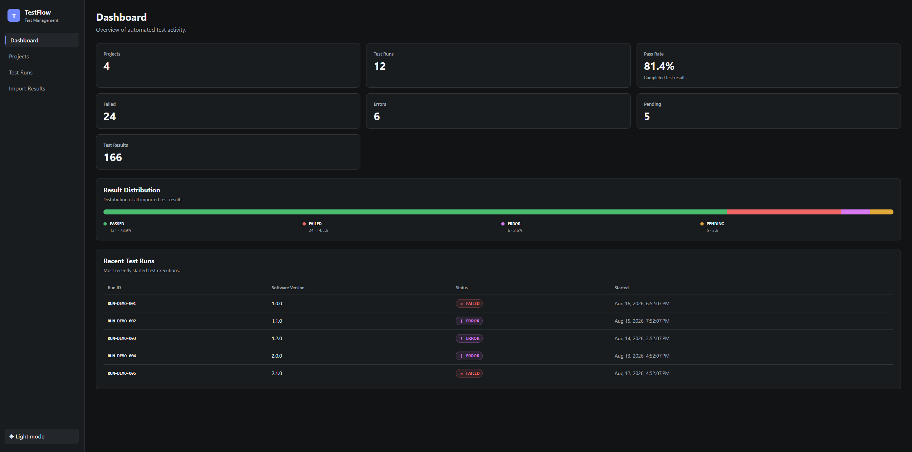

# TestFlow – Test Result Management Dashboard

TestFlow is a full-stack web application for managing, importing, filtering and analyzing automated software test results.

Built with Angular, TypeScript, Python, Flask, MongoDB, pandas, PyArrow, Docker and automated testing.

> This is an independent portfolio project created to demonstrate full-stack software development and test-data processing skills. It is not affiliated with, derived from, or based on any proprietary system of my current or former employers.

## Features

- Project management
- Test suite management
- Test run creation and filtering
- Individual test result inspection
- Automatic run status aggregation
- JSON test result import
- Parquet test result import
- pandas and PyArrow based validation
- Dashboard statistics
- Test result status distribution
- Light and dark themes
- Responsive developer-tool style UI
- Automated backend and frontend tests
- Docker-based local environment
- GitHub Actions CI

## Test Status Aggregation

TestFlow calculates the overall status of a test run from its individual test results using the following priority:

1. ERROR
2. FAILED
3. PENDING
4. PASSED

For example:

- If at least one result is `ERROR`, the run status is `ERROR`.
- Otherwise, if at least one result is `FAILED`, the run status is `FAILED`.
- Otherwise, if at least one result is `PENDING`, the run status is `PENDING`.
- Otherwise, the run status is `PASSED`.

## Technology Stack

### Frontend

- Angular
- TypeScript
- HTML
- CSS
- Angular Router
- Angular Reactive Forms
- Angular HttpClient
- Signals

### Backend

- Python
- Flask
- PyMongo
- Flask-CORS

### Data Processing

- pandas
- PyArrow
- JSON
- Parquet

### Database

- MongoDB

### Testing

- pytest
- Angular unit tests
- Vitest
- Flask integration tests

### Development and CI

- Git
- GitHub
- Docker
- Docker Compose
- GitHub Actions

## Architecture

```text
Angular frontend
      |
      | REST / JSON
      v
Flask API
      |
      +----------------------+
      |                      |
      v                      v
Application services     Validators
      |                  JSON / Parquet
      v                      |
Repositories                 |
      |                      |
      +----------+-----------+
                 |
                 v
              MongoDB
```
Backend responsibilities are separated into routes, services, repositories, validators, models and database infrastructure.

Import formats are normalized before entering the shared import service:
```text
JSON --------> JSON validator ----+
                                  |
                                  v
                           normalized results
                                  |
                                  v
                             ImportService
                                  |
                                  v
Parquet --> pandas/PyArrow ------+
            validator
                                  |
                                  v
                              MongoDB
                                  |
                                  v
                         status aggregation
```
## Project Structure
```text
testflow/
├── backend/
│   ├── app/
│   │   ├── models/
│   │   ├── repositories/
│   │   ├── routes/
│   │   ├── services/
│   │   ├── utils/
│   │   └── validators/
│   ├── scripts/
│   ├── tests/
│   ├── Dockerfile
│   └── requirements.txt
│
├── frontend/
│   ├── src/
│   │   └── app/
│   │       ├── core/
│   │       ├── features/
│   │       └── shared/
│   ├── Dockerfile
│   └── nginx.conf
│
├── sample-data/
├── .github/
│   └── workflows/
├── docker-compose.yml
└── README.md
```
## REST API Overview
### Projects
```text
GET    /api/v1/projects
POST   /api/v1/projects
GET    /api/v1/projects/{id}
PATCH  /api/v1/projects/{id}
DELETE /api/v1/projects/{id}
```
### Test Suites
```text
GET    /api/v1/projects/{project_id}/test-suites
POST   /api/v1/projects/{project_id}/test-suites
GET    /api/v1/test-suites/{id}
PATCH  /api/v1/test-suites/{id}
DELETE /api/v1/test-suites/{id}
```
### Test Runs
```text
GET    /api/v1/test-runs
POST   /api/v1/test-runs
GET    /api/v1/test-runs/{id}
DELETE /api/v1/test-runs/{id}
```
Supported test run filters include:
```text
project_id
status
software_version
date_from
date_to
```
### Test Results
```text
GET  /api/v1/test-runs/{id}/results
POST /api/v1/test-runs/{id}/results
```
### Imports
```text
POST /api/v1/test-runs/{id}/results/import/json
POST /api/v1/test-runs/{id}/results/import/parquet
```
### Dashboard
```text
GET /api/v1/dashboard/stats
```
## Parquet Validation
Parquet imports use pandas and PyArrow.

Required columns:
```text
test_name
status
duration_ms
timestamp
```
Validation includes:

- required columns
- supported status values
- non-negative numeric durations
- valid timestamps
- readable Parquet format
- optional error message validation

Invalid imports are rejected before any partial data is written.
## Running with Docker
Build and start the application:
```bash
docker compose up --build -d
```
Seed fictional demo data:
```bash
docker compose exec backend python -m scripts.seed_data
```
Open:
```text
Frontend: http://localhost:4200
Backend:  http://localhost:5000
```
Stop:
```bash
docker compose down
```
## Local Development
### Backend
```bash
cd backend
python -m venv .venv
```
Windows PowerShell:
```powershell
.\.venv\Scripts\Activate.ps1
```
Install dependencies:
```bash
python -m pip install -r requirements.txt
```
Start MongoDB:
```bash
docker compose up -d mongodb
```
Run Flask:
```bash
python run.py
```
Run tests:
```bash
python -m pytest -v
```
### Frontend
```bash
cd frontend
npm ci
ng serve
```
Open:
```text
http://localhost:4200
```
Run tests:
```bash
npm test -- --watch=false
```
Build:
```bash
npm run build
```
## Demo Data
The repository includes a deterministic seed script that generates fully fictional development data.

It creates:

- 4 projects
- 12 test suites
- 12 test runs
- multiple test results per run
- PASSED, FAILED, ERROR and PENDING states
- fictional performance measurements

Run locally from the backend directory:
```bash
python -m scripts.seed_data
```
Sample import files are available in:

```text
sample-data/
├── sample-results.json
└── sample-results.parquet
```
Both files contain fully fictional automated test data and can be used with the Import Results UI.
## Continuous Integration
GitHub Actions runs automatically on pushes and pull requests to the repository's default branch.

CI performs:

- backend dependency installation
- MongoDB service startup
- pytest backend tests
- frontend dependency installation
- Angular/Vitest tests
- Angular production build
## Screenshots
### Dashboard

### Projects

### Project Details and Test Suites

### Test Runs

### Test Run Details

### JSON / Parquet Import

### Dark Mode

## Design Goals
The project prioritizes:

- clear architecture
- readable code
- explicit validation
- meaningful automated tests
- predictable API behavior
- reusable Angular components
- format-independent result processing
- straightforward maintainability

The implementation intentionally avoids unnecessary framework complexity in favor of code that is easy to understand and extend.
## License

This project is available under the MIT License.